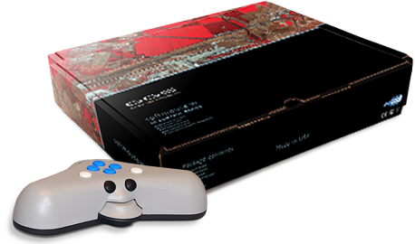

# Configura Digi3D.NET para trabajar con un Soft Mouse

Ayuda online de productos Digi21

Configura Digi3D.NET para trabajar con un Soft Mouse

Si tu dispositivo de entrada es un _SoftMouse_ tienes que instalar tanto el controlador del dispositivo como configurar Digi3D.NET para que utilice este dispositivo como dispositivo principal.

* Entra en la página web del fabricante del dispositivo: [http://www.softmouse3d.com/](http://www.softmouse3d.com/)
* Pulsa en el enlace **Driver**.
* Pulsa en el botón **Link**.
* El navegador se irá a otra página distinta. Esta página \(SiLabs\) es la página del puerto USB que lleva incorporado el dispositivo.
* Descarga el **USBXpress Development**

