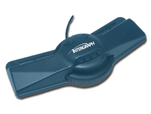

# Configura Digi3D.NET para trabajar con un Topo Mouse

Si tu dispositivo de entrada es un _TopoMouse_, tienes que instalar tanto el controlador del dispositivo como configurar Digi3D.NET para que utilice este dispositivo como dispositivo principal.

1. Entra en la página web del fabricante del dispositivo: [http://www.pac-geo.com/](http://www.pac-geo.com/)
2. Pulsa en el enlace **Driver**.
3. Pulsa en el botón **Link**.
4. El navegador se irá a otra página distinta. Esta página \(SiLabs\) es la página del puerto USB que lleva incorporado el dispositivo.
5. Descarga el **USBXpress Development Kit** correspondiente con tu sistema operativo.
6. Ejecuta el instalador.
7. Conecta el topomouse al puerto **USB**. Windows reconocerá el dispositivo e instalará el driver.
8. El instalador en realidad ha instalado dos componentes completamente distintos:

   * El controlador.
   * El Kit de desarrollo de software.

   De estos dos componentes únicamente nos interesa el primero, así que vamos a desinstalar el segundo.

9. Ejecuta el programa **Agregar o quitar programas**.
10. Localiza el programa **USBXpress Software Development Kit** y desinstálalo.

Vea también

