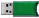

# Glosario

[.](glosario.md#.) \| [A](glosario.md#A) \| [B](glosario.md#B) \| [C](glosario.md#C) \| [D](glosario.md#D) \| [E](glosario.md#E) \| [F](glosario.md#F) \| [G](glosario.md#G) \| [H](glosario.md#H) \| [I](glosario.md#I) \| J \| K \| L \| [M](glosario.md#M) \| [N](glosario.md#N) \| [O](glosario.md#O) \| [P](glosario.md#P) \| Q \| R \| [S](glosario.md#S) \| [T](glosario.md#T) \| U \| [V](glosario.md#V) \| [W](glosario.md#W) \| X \| Y \| Z

## .

> **.bin**  
>
>
> Archivo de dibujo binario de precisión simple de Digi. Este archivo ha sido el estándar de Digi hasta la versión .NET que introdujo los archivos de dibujo binarios de doble precisión.
>
> **.bind**  
>  Archivo binario de doble precisión. Introducido a partir de la versión Digi3D.NET que incluye mejoras como tener asociado un sistema de coordenadas de referencia, la no necesidad de tener que indicar la precisión y el origen global del archivo, memorización de archivos de referencia cargados,...
>
> **.c2v**  
>  Archivo _Client To Vendor_ con información de tu llave de protección. Nos sirve para actualizar remotamente tu llave de protección para añadirle o eliminarle licencias de programas.
>
> **.cel**  
>  Archivo de células de MicroStation. Es un archivo que contiene definiciones de células \(símbolos\)
>
> **.d3d**  
>  Archivo de proyecto de par estereoscópico. Define por un lado el sensor y sus parámetros \(rutas a las imágenes, archivos de orientaciones,...\) y por otro parámetros de configuración como última coordenada conocida,...
>
> **.d3dprj**  
>  Archivo de proyecto de cambio rápido de modelos. Permite cambiar de modelo rápidamente en el Panel de Cambio rápido de modelos.
>
> **.mdt**  
>  Archivos de Modelos Digitales Topográficos creados con el programa MDTopX
>
> **.prj**  
>  Archivo en el que se almacena el sistema de coordenadas de referencia asociado a un archivo de dibujo. El contenido de este archivo es una cadena Well Known Text.
>
> **.v2c**  
>  Archivo _Vendor To Client_ con la información necesaria para programar tu llave de protección.

## A

> **anaglifo**  
>  Sistema que permite la visualización estereoscópica utilizando gafas con filtros de colores. Tiene la particuladirad de que degrada el color pero permite la visualización estereoscópica en ordenadores de gama baja.
>
> **archivo de activación de ordenador**  
>  Archivo con la información necesaria para activar un ordenador en una llave de protección en modo offline.
>
> **archivo de definición de códigos**  
>  Archivo XML que contiene la simbología de visualización de las entidades de dibujo, es decir los códigos de dibujo.
>
> **archivo de solicitud de activación**  
>  Archivo generado con el programa **Activar Ordenador Offline** para activar ordenadores sin conexión a internet.
>
> **autozoom**  
>  La pantalla sigue al cursor en sus desplazamientos por el dibujo.
>
> **azimut**  
>  Ángulo de una dirección contado en el sentido de las agujas del reloj a partir del Norte Geográfico.

## B

> **botón de cancelar**  
>  Botón derecho del ratón
>
> **botón de dato**  
>  Botón izquierdo del ratón
>
> **botón de tentativo**  
>  Botón central del ratón.

## C

> **CAD**  
>
>
> Computer-aided design o diseño asistido por ordenador. Es un conjunto de herramientas que permiten a los ingenieros, arquitectos y diseñadores en sus respectivas actividades. Existen tanto aplicaciones CAD en 2D como en 3D.
>
> **cancelar del ratón**  
>
>
> **centroides**  
>  Punto interior a un polígono, que se emplea para identificar al mismo. En Digi3D.NET los centroides son entidades de tipo texto, el punto de inserción del texto define las coordenadas del centroide. La identificación del polígono es el valor del texto, que puede llevar información adicional mediante sus atributos.
>
> **código lineal**  
>  Código pensado en principio para dibujar líneas, por lo tanto Digi3D.NET ejecuta la orden LINEA si pulsamos el botón de DATO y el programa está en modo Preparado.
>
> **código puntual**  
>  Código pensado en principio para dibujar líneas, por lo tanto Digi3D.NET ejecuta la orden PUNTO si pulsamos el botón de DATO y el programa está en modo Preparado.
>
> **conector estéreo**  
>  Es un conector, usualmente llamado DIN-3 o conector Stereographics que comunica la tarjeta gráfica con el emisor de las gafas, para indicarle cual de los dos ojos tiene permiso para ver en un determinado momento.
>
> **correlación**  
>  Proceso por el cual se localizan imágenes homólogas de forma automática

## D

> **De información**  
>  Proporciona información de la entidad seleccionada
>
> **DIGI.PAL**  
>  Fichero de texto en que se especifican las componentes RGB del color que se quiere asignar a un determinado número.
>
> **Digi3D**  
>
>
> **DirectX**  
>
>
> Lenguaje de gráficos propiedad de Microsoft. Únicamente compatible con sistemas operativos Windows.

## E

> **Equidistancia**  
>  Diferencia de altitud entre dos curvas de nivel sucesivas
>
> **Escáner fotogramétrico**  
>  Escáner de imágenes con la particularidad de utilizar codificadores de alta precisión y ópticas buenas que garantizan que la imagen obtenida no tiene a penas errores geométricos provocados por el proceso de escaneo.
>
> **Estéreo entrelazado de gafa pasiva**  
>  Este tipo de visión estereoscópica es cómoda porque es pasiva \(no se está cancelando la visión de un ojo por una fracción de segundo\) y además no requiere el uso de tarjetas gráficas Quad-Buffer. Sin embargo es entrelazado, por lo tanto las imágenes se visualizan únicamente con la mitad de la resolución del monitor.
>
> **Estéreo profesional page-flipping**  
>  Sistema de visión estereoscópica profesional. Requiere hardware especial como tarjetas gráficas con Quad-Buffer como la familina Quadro de nVidia. Permite estereo con el 100% de la resolución del monitor.
>
> **Estereoscópico**  
>
>
> **Estereoscópicos**  
>  Con dos imágenes que permiten visión tridimensional
>
> **Estereóscopo para monitores**  
>  Mecanismo con espejos y óptica que permite visualizar estereoscópicamente imágenes mostradas en la parte izquierda y derecha de un monitor.

## F

> **formato PatB**  
>  Formato de intercambio de resultados de aerotriangulaciones estándar de facto. Todas las estaciones de fotogrametría y programas de cálculo de aerotriangulaciones con capaces de importar este tipo de archivos.

## G

> **generalización**  
>  Eliminación de puntos superfluos

## H

> **Hasp HL**  
>
>
> Llave de protección física, de color verde, que se conecta al ordenador mediante un puerto USB.
>
> 
>
> **Hasp SL**  
>  Llave de protección por software

## I

> **isohipsas**  
>  Líneas contínuas utilizadas en la representación del relieve de los mapas topográficos, que unen puntos situados a la misma altitud.

## M

> **modo preparado**  
>  Si Digi3D.NET no está ejecutando ninguna orden, está en "Modo preparado".
>
> **monitores auto-estereoscópicos**  
>  Monitores que permiten la visualización estereoscópica sin necesidad de gafas. Este tipo de visión no requiere el uso de tarjetas gráficas Quad-Buffer. Sin embargo tiene la particuladirad de que es entrelazado, por lo tanto las imágenes se visualizan únicamente con la mitad de la resolución.
>
> **Monoscópicos**  
>  Con una única imagen.
>
> **MS-DOS**  
>  MicroSoft Disk Operating System, Sistema operativo en disco de Microsoft. Es un sistema operativo para ordenadores basados en x86. Nace en el año 1981 por un engargo de IBM a Microsoft.

## N

> **nVidia 3DVision**  
>  Sistema de estéreo activo formado por gafas activas fabricadas por nVidia y monitores fabricados por terceros y certificados por nVidia.

## O

> **OpenGL**  
>  Lenguaje de programación de gráficos
>
> **Orden inmediata**  
>  Tipo de orden que se ejecuta automáticamente.
>
> **Orden interactiva**  
>  Tipo de orden que requiere que el usuario digitalice puntos en la ventana de dibujo.
>
> **Orientación absoluta**  
>  Transformación 3D que permite ubicar un modelo en el espacio.
>
> **Orientación interna**  
>  Orientación que permite relacionar las coordenadas pixel de la imagen con las coordenadas fiduciales de esta.
>
> **Orientación relativa**  
>  Orientación que se realiza con dos imágenes adyacentes que consiste en localizar puntos homólogos y que permiten su visualización estereoscópica.
>
> **orto-fotografías**  
>  Imagen rectificada que garantiza que todos sus píxeles tienen un tamaño constante.

## P

> **pares estereoscópicos**  
>  Modelo formado por dos imágenes que permiten visualización estereoscópica \(en 3D\) en la zona en la que solapan ambas imágenes.
>
> **PatB**  
>  Programa de cálculo de aerotriangulaciones. Este es uno de los primeros programas de cálculo de aerotriangulaciones que existieron y su formato lo reconocen todas las estaciones de fotogrametría, ya que es un estándar de facto.
>
> **Planar 3D**  
>  Sistema de visión estereoscópica compuesto por dos monitores montados perpendicularmente y un espejo semi-transparence orientado 45 grados con respecto a los dos monitores. Es el monitor estereoscópico más cómodo que existe.
>
> **POLILINEAS**  
>
>
> **polilíneas**  
>  Entidad formada por uno o más segmentos de línea \(rectas o arcos\).
>
> **pseudo-estereoscópica**  
>  Efecto que sucede al intercambiar las imágenes izquieda y derecha. Produce dolor de cabeza.
>
> **puntos de apoyo**  
>  Puntos con coordenadas conocidas a los que se les ha asignado un nombre.

## S

> **Shading Languaje**  
>  Lenguaje de programación de tarjetas gráficas que requiere tarjetas con múltiples núcleos
>
> **sistemas de manivelas**  
>  Conjunto de tres manivelas, dos de ellas se atornillan a la base de una mesa y la tercera se ubica en el suelo, que permiten al usuario digitalizar con gran velocidad y precisión después de un entrenamiento.
>
> **SPLINE**  
>  Curva matemática suavizada, que representa una variación espacial y que pasa a través de un conjunto de puntos digitalizados por el usuario.
>
> **SPLINES CÚBICAS**  
>  Spline con continuidad en la primera y segunda derivada y con la restricción de que la curva pasa por todos los puntos digitalizados.
>
> **Super-imposición vectorial**  
>  Visualizar los vectores de las geometrías existentes sobre las imágenes.

## T

> **tentativos**  
>  Tentativo o snap, consiste en localizar las coordenadas del vértice o proyección sobre un segmento de una geometría existente.
>
> **topología**  
>  Relaciones que ligan a un polígono con los tramos que lo forman, su centroide y las islas o polígonos interiores que contiene.
>
> **topo-mouse**  
>  Ratón 3D con un codificador en el eje de la coordenada Z que permite digitalizar con gran precisión. Usualmente disponen de varios botones que son configurables por parte del usuario.
>
> **tramos**  
>
>
> Lados que forman los polígonos. Son entidades lineales, que tienen que conectar mediante nodos comunes, encerrando al polígono.
>
> El tramo común a dos polígonos es único, no se duplica, el programa lo asigna a cada uno de ellos en el fichero topológico con extensión TOP.
>
> **tri-estereoscópicos**  
>  Con tres imágenes. El usuario es libre de seleccional el par de imágenes con el que visualizar en 3D.

## V

> **Variable booleana**  
>  Variable que puede tener dos valores: Verdadero y Falso. Si indicamos como parámetro un 0, se asigna el valor Falso. Si indicamos como parámetro un 1, se asigna el valor verdadero. Si no se indica ningún parámetro, se cambia de Verdadero a Falso y de Falso a Verdadero.
>
> **Variable real**  
>  Variable en la que se almacenan números reales.

## W

> **Web Map Service**  
>  Es un servidor al que se le pueden solicitar imágenes, que habitualmente son mapas. Estos mapas pueden estar formados por multitud de capas. El usuario es libre de elegir las capas que quiere solicitar al servidor.

