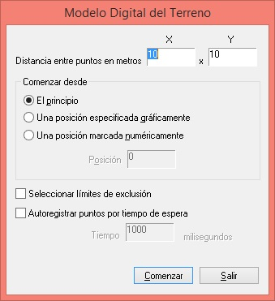

# MDT

Establece una rejilla por la cual se va a mover el restituidor pudiendo registrar los puntos a los que llega el cursor.

## Parámetros

## Observaciones

Podemos seleccionar una entidad que actúe como borde de la rejilla y podemos seleccionar la opción de autoregistrar puntos cada cierto tiempo marcado por la orden [TIEMPO\_ESPERA](tiempo_espera.md).

También aquí se puede marcar la casilla _Seleccionar límites de exclusión_ para que el programa tenga en cuenta que, dentro del límite que se selecciona para del modelo digital del terreno, puede haber una o varias entidades cerradas sobre las cuales no queremos que correle el programa. En caso de marcar esta casilla, el programa pedirá seleccionarlos al hacer el Modelo Digital del Terreno.

## Características de la orden

| Tipo de orden | [Orden interactiva](mdt.md) |
| :--- | :--- |
| Repite automáticamente | No |
| Opción del menú donde aparece la orden | MDT/Modelo Digital del Terreno manual.. |
| Barra de herramientas en la que aparece la orden | _Esta orden no tiene asociado ningún botón en ninguna barra de herramientas_ |
| Extensión | DigiNG.OrdenesStandard.dll |
| Variables relacionadas | No tiene variables relacionadas |

## Vídeo

