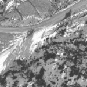
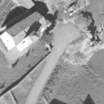

# Midiendo la primera orientación absoluta de un proyecto

El proceso de medir una orientación absoluta consiste en identificar en el modelo puntos con coordenadas conocidas. Estos puntos son los denominados puntos de apoyo.

Necesitaremos pues un archivo con las coordenadas de los puntos de apoyo, así como un croquis que nos indique donde medir cada uno de estos puntos de apoyo.

A continuación tienes la posición \(en la foto _107_\) de los puntos que vas a medir:

Y a continuación una tabla con los puntos a medir en mayor detalle \(y por orden de medida\), puedes hacer _clic_ en las fotos para verlas a tamaño real:

<table>
  <thead>
    <tr>
      <th style="text-align:left">Orden</th>
      <th style="text-align:left">N&#xFA;mero de punto</th>
      <th style="text-align:left">Coordendas p&#xED;xel en la imagen 107</th>
      <th style="text-align:left">Captura</th>
    </tr>
  </thead>
  <tbody>
    <tr>
      <td style="text-align:left">1</td>
      <td style="text-align:left">7</td>
      <td style="text-align:left">9527.7, 7713.6</td>
      <td style="text-align:left">
      </td>
    </tr>
    <tr>
      <td style="text-align:left">2</td>
      <td style="text-align:left">6</td>
      <td style="text-align:left">8894.9, 5296.1</td>
      <td style="text-align:left">
      </td>
    </tr>
    <tr>
      <td style="text-align:left">3</td>
      <td style="text-align:left">3</td>
      <td style="text-align:left">6297.8, 3308.4</td>
      <td style="text-align:left">
        

        

        
Punto 3 en a foto 107

      </td>
    </tr>
    <tr>
      <td style="text-align:left">4</td>
      <td style="text-align:left">4</td>
      <td style="text-align:left">5798.8, 66571.8</td>
      <td style="text-align:left">
        

        

        
Punto 4 en la foto 107

      </td>
    </tr>
    <tr>
      <td style="text-align:left">5</td>
      <td style="text-align:left">5</td>
      <td style="text-align:left">10703.4, 2432.8</td>
      <td style="text-align:left">
        

        

        
Punto 5 en la foto 107

      </td>
    </tr>
  </tbody>
</table>

Es necesario que finalices los pasos de [Midiendo la orientación relativa automáticamente](midiendo-la-orientacion-relativa-automaticamente.md) antes de ejecutar los siguientes pasos para medir una orientación absoluta:

1. Pulsa el botón **Orientación absoluta** de la barra de herramientas de la ventana fotogramétrica. Aparecerán dos paneles acoplados a la ventana fotogramétrica: **Orientación Absoluta** e **Instantáneas**. El panel **Orientación absoluta** es el que nos sirve para medir la orientación absoluta. El panel **Instantáneas** sirve para mostrarnos dónde se midió un determinado punto en otra imagen si éste punto ya se midió con anterioridad. 
2. Es posible que además aparezca el [Cuadro de diálogo Introduce un punto terreno del archivo de puntos](cuadro-de-dialogo-introduce-un-punto-terreno-del-archivo-de-puntos.md). Si es así, pulsa el botón **Cancelar** para cerrarlo.
3. El panel **Orientación absoluta** muestra arriba del todo la ruta al archivo de puntos de apoyo así como el [Sistema de referencia de coordenadas](sistemas-de-referencia-de-coordenadas.md) en el que están las coordenadas de los puntos de apoyo enumerados en ese archivo.
4. Pulsa el botón **...** justo a la derecha de la ruta al archivo de puntos de apoyo. Aparecerá el [Cuadro de diálogo Archivo de puntos de apoyo](cuadro-de-dialogo-archivo-de-puntos-de-apoyo.md).
5. Pulsa el el botón **...** para especificar la ruta del archivo de puntos de apoyo. Aparecerá el cuadro de diálogo **Abrir**.
6. Localiza y selecciona el archivo _%EjemplosDigi3D%\Bronchales\Bronchales.xyz_ y pulsa el botón **Abrir**.
7. Pulsa el botón **...** para para especificar el sistema de referencia de coordenadas de los puntos de apoyo. Aparecerá el [Cuadro de diálogo Sistema de Referencia de Coordenadas](cuadro-de-dialogo-sistema-de-referencia-de-coordenadas.md).
8. Selecciona la opción **Proyectado + Vertical** en la parte iquierda.
9. En el desplegable **Sistema de referencia de coordenadas proyectado** localiza la opción _WGS 84 / UTM Zone 30N_.
10. En el desplegable **Sistema de coordenadas vertical** selecciona _EGM08\_REDNAP Península_.
11. Pulsa el botón **OK**.
12. Comprueba que el cuadro de diálogo **Archivo de puntos de apoyo** muestra en el campo **Sistema de referencia de coordenadas** lo siguiente: _WGS 84 / UTM Zone 30N + EGM08\_REDNAP Península_.
13. Pulsa el botón **Aceptar**.
14. Comprueba que en el panel **Orientación absoluta** aparece tanto la ruta del archivo de puntos de apoyo como el sistema de referencia de coordenadas de éste.
15. Pulsa el botón **Añadir**. Aparecerá el [Cuadro de diálogo Introduce un punto terreno del archivo de puntos](cuadro-de-dialogo-introduce-un-punto-terreno-del-archivo-de-puntos.md). Selecciona el punto **7** y pulsa el botón **Aceptar**.
16. Comprueba que en la parte inferior del panel **Orientación absoluta** el programa te está invitando a digitalizar el punto número **7.**
17. Localiza el punto **7.** Una vez localizado pulsa cualquier botón de tu dispositivo de entrada para confirmar la medida.
18. Aparecerá el cuadro de diálogo **Introduce un punto terreno del archivo de puntos**.
19. Selecciona el punto número **6** y pulsa el botón **Aceptar.**
20. Localiza el punto **6**. Una vez localizado pulsa cualquier botón de tu dispositivo de entrada para confirmar la medida.
21. Observa que **ya no se vuelve a mostrar** el cuadro de diálogo **Introduce un punto terreno del archivo de puntos**. Con las dos medidas que hemos realizado anteriormente, Digi3D.NET ya se ha hecho una idea de los puntos que entran dentro del modelo y ha localizado automáticamente el siguiente punto que entra dentro del modelo. Comprueba que en la parte inferior del panel **Orientación absoluta** se nos está invitando a digitalizar el punto número **3.**
22. El programa ha calculado de forma automática la posición donde en teoría debería de estar el punto número **3**, pero como por ahora únicamente hemos medido dos puntos, no puede llevarnos con total precisión. En teoría con desplazar la coordenada Z tendríamos que llegar correctamente al punto. Localiza el punto. Una vez localizado pulsa cualquier botón de tu dispositivo de entrada para confirmar la medida.
23. El programa se desplazará al punto número **4** y te invitará a digitalizalo. Pósate estereoscópicamente y pulsa cualquier botón de tu dispositivo de entrada.
24. Por último el progrma solicitará que digitalices el punto número **5**. Pósate estereoscópicamente y pulsa cualquier botón de tu dispositivo de entrada.
25. El programa deja de solicitar que digitalices puntos. Ahora comprueba los resíduos de cada punto. Puedes pulsar el botón **Peor** para que el programa localice automáticamente el punto con mayores resíduos. Se marcará el peor de los puntos en la lista de puntos de appoyo medidos y además la ventana fotogramétrica se desplazará a ese punto en particular.
26. Si quieres remedir un punto, tan solo tienes que pulsar el botón **Remedir**. El programa entrará en modo remedir y tan solo tendrás que digitalizar el punto donde te interese. El programa calcula orientaciones absolutas cada vez que te mueves, de modo que es capaz de mostrar el resultado de la orientación antes de que confirmes el punto. Eso te puede ayudar para comprobar hacia dónde tienes que medir el punto. Esto se utiliza si tienes dudas, como por ejemplo si la reseña de un punto de apoyo indica que hay que medir el punto en el centro de una piedra y encuentras que hay varias piedras. De esta manera el programa te ayuda a localizar la piedra en cuestión. Puedes pulsar en cualquer momento la tecla **Esc** para cancelar la remedida del punto.
27. Pulsa el botón **Aceptar** para aceptar la orientación absoluta. 

## Vídeo

Vea también

