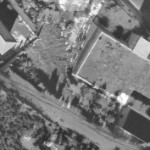
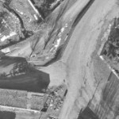
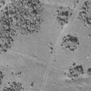
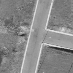
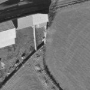
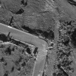

# Midiendo la segunda orientación absoluta

La segunda orientación absoluta es más sencilla que la primera, pues el programa ya sabe la posición de algunos puntos en una de las imágenes.

Una vez indicado el punto que queremos medir, el programa comprueba si dicho punto está ya medido en alguna foto. En caso afirmativo bloqueará esa foto de modo que aunque movamos nuestro dispositivo de entrada \(ratón, topomouse, manivelas\) en _X,Y_ las imágenes no se moverán. Únicamente podremos mover la imagen donde el punto no fue medido mediante un movimiento de la coordenada _Z,_ de esta manera nos aseguramos de que ese punto no se mida en la misma foto en otra posición.

Además, gracias a que el programa almacena una instantánea por cada punto medido, si tenemos abierto el [Panel Instantáneas](panel-instantaneas.md) podremos ver dónde se midió ese punto por primera vez.

Es necesario que finalices los pasos de [Archivos De Orientacion Absoluta](archivos-de-orientacion-absoluta.md) antes de ejecutar los siguientes pasos para comprobar los archivos que se han generado:

A continuación tienes la posición \(en la foto 107\) de los puntos que vas a medir en este modelo \(son los que aparecen en color rojo\):

Y a continuación una tabla con los puntos a medir en mayor detalle \(y por orden de medida\), puedes hacer clic en las fotos para verlas a tamaño real

<table>
  <thead>
    <tr>
      <th style="text-align:left">Orden</th>
      <th style="text-align:left">N&#xFA;mero de punto</th>
      <th style="text-align:left">Coordenadas p&#xED;xel en la imagen 108</th>
      <th style="text-align:left">Captura</th>
    </tr>
  </thead>
  <tbody>
    <tr>
      <td style="text-align:left">1</td>
      <td style="text-align:left">7</td>
      <td style="text-align:left">5080.5, 7565.0</td>
      <td style="text-align:left">
        

        

        
Punto 7 en la foto 107

      </td>
    </tr>
    <tr>
      <td style="text-align:left">2</td>
      <td style="text-align:left">6</td>
      <td style="text-align:left">4605.1, 5155.6</td>
      <td style="text-align:left">
        

        

        
Punto 6 en la foto 107

      </td>
    </tr>
    <tr>
      <td style="text-align:left">3</td>
      <td style="text-align:left">5</td>
      <td style="text-align:left">6357.8, 2301.4</td>
      <td style="text-align:left">
        

        

        
Punto 5 en la foto 107

      </td>
    </tr>
    <tr>
      <td style="text-align:left">4</td>
      <td style="text-align:left">8</td>
      <td style="text-align:left">9986.2, 2338.0</td>
      <td style="text-align:left">
        

        

        
Punto 8 en la foto 108

      </td>
    </tr>
    <tr>
      <td style="text-align:left">5</td>
      <td style="text-align:left">9</td>
      <td style="text-align:left">10269.1, 5557.6</td>
      <td style="text-align:left">
        

        

        
Punto 9 en la foto 108

      </td>
    </tr>
    <tr>
      <td style="text-align:left">6</td>
      <td style="text-align:left">10</td>
      <td style="text-align:left">9707.6, 10124.8</td>
      <td style="text-align:left">
        

        

        
Punto 10 en la foto 108

      </td>
    </tr>
  </tbody>
</table>

1. Cierra la ventana fotogramétrica que tienes abierta con el modelo _107-108_.
2. Abre el menú **Archivo** y selecciona la opción **Nuevo/Abrir modelo fotogramétrico o archivo de dibujo**.
3. Se muestra el cuadro de diálogo **Nuevo Proyecto**.
4. Selecciona la pestaña **Sensores Fotogramétricos**.
5. En el campo **Directorio de trabajo** selecciona la ruta **%EjemplosDigi3D%\Bronchales**.
6. En el campo **Tipo de sensor** selecciona **Cónico \(estereoscópico\)**. Comprobarás que la sección titulada **Propiedades del sensor** varía para solicitar los archivos requeridos para cargar un modelo estereoscópico de cámara cónica.      
7. El campo **Archivo de aerotriangulación** déjalo vacío, pues no disponemos de ningún archivo de aerotriangulación. Este es un campo opcional que rellenaremos únicamente si disponemos de un archivo de aerotriangulación.
8. En el campo **Imagen izquierda** indica la ruta al archivo %EjemplosDigi3D%\Bronchales\108.tif
9. En el campo **Imagen derecha** indica la ruta al archivo %EjemplosDigi3D%\Bronchales\109.tif
10. En el campo **Cámara izquierda** indica la ruta al archivo %EjemplosDigi3D%\Bronchales\RMK15.cam
11. En el campo **Cámara derecha** indica la ruta al archivo %EjemplosDigi3D%\Bronchales\RMK15.cam
12. Pulsa el botón **Aceptar**. Se abrirá la ventana fotogramétrica mostrando el modelo _108-109_.
13. Comprueba que el botón **I** de la **Barra de herramientas** de la ventana fotogramétrica está encendido, el resto de botones permanecerán apagados. Esto es así porque por ahora tenemos únicamente la orientación interna de la cámara izquierda. No hemos realizado aún la orientación interna de la cámara derecha, ni la orientación relativa.
14. Genera la [orientación interna de la cámara derecha](orientacion-interna-de-la-camara-derecha.md).
15. Genera la [orientación relativa](midiendo-la-orientacion-relativa-automaticamente.md) del modelo.
16. Pulsa el botón **Orientación absoluta** para comenzar a medir la orientación absoluta.
17. En el [cuadro de diálogo Introduce un punto terreno del archivo de puntos](cuadro-de-dialogo-introduce-un-punto-terreno-del-archivo-de-puntos.md) selecciona el punto número **7**. Recuerda que el punto número _7_ ya había sido medido en la foto _108_ \(en el modelo anterior era la foto derecha, en este modelo es la foto izquierda\), de modo que por el mero echo de medirlo el programa mueve la cámara izquierda a esas coordenadas y **bloquea** la cámara izquierda. No podemos mover la imagen en _X,Y_ con nuestro dispositivo de entrada, únicamente podemos moverla en _Z_, y ese movimiento de la coordenada _Z_ de nuestro dispositivo de entrada únicamente va a permitirnos mover la imagen que no tiene ese punto ya medido. De esta manera, tenemos la garantía de que el punto _7_ se va a medir en la foto _108_ exactamente en el mismo punto en el que se midió en el modelo anterior. Además puedes comprobar que el programa va a localizar automáticamente la otra imagen por [correlación](midiendo-la-segunda-orientacion-absoluta.md), de manera que si el proceso de correlación no ha fallado, tan solo tendremos que confirmar que el punto se ha medido bien.
18. Digitaliza el punto número **7** pulsando cualquier botón de tu dispositivo de entrada.
19. Aparece el _cuadro de diálogo Introduce un punto terreno del archivo de puntos._ Selecciona ahora el punto número **6**. Vuelve a suceder lo mismo que en el punto anterior.
20. Mide el punto número **6** pulsando cualquier botón de tu dispositivo de entrada.
21. A partir de este momento el programa te va guiando y ordenando que midas puntos. Mide los puntos 5, 8, 9 y 10.
22. Confirma la orientación absoluta pulsando el botón **Aceptar**.

## Vídeo

