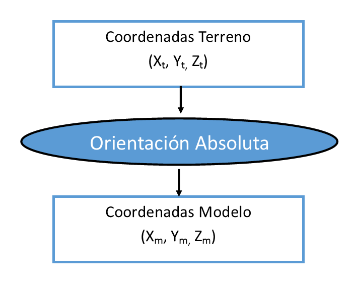

# Orientación Absoluta

Es una _transformación afín_ utilizada habitualmente para ubicar y escalar un modelo en función de unos puntos de apoyo medidos.

Estra transformación transforma de _Coordenadas Terreno_ a _Coordenadas Modelo_ y viceversa.

La orden [ORI\_ABSOLUTA](ori_absoluta.md) es la encargada de calcular y crear _Orientaciones Absolutas_. Lo habitual es crear una _Orientación Absoluta_ en el [Sensor Cónico](sensor-conico-estereoscopico.md), en un modelo que no ha sido aerotriangulado y para el cual únicamente disponemos de una [Orientación Relativa](Orientaci-n%20Relativa.html), ya que esta orientación relativa no se ha calculado teniendo en cuenta los puntos de apoyo del terreno, por lo tanto sus coordenadas están en un _sistema local_, pero la _Orientación Absoluta_ está presente en todos los sensores, no únicamente en el _Sensor Cónico_.

Al ser una simple _transformación afín_, no se pueden mezclar unidades como ángulos y metros, ni se pueden mezclar proyecciones como el local de la relativa con el UTM de los puntos de apoyo. La orden ORI\_ABSOLUTA es capaz de detectar los sistemas en los que están los puntos de apoyo y las coordenadas modelo. En caso de no ser compatibles, se incorporará a la orientación absoluta una transformación del estos sistemas a Coordenadas Geocéntricas y el cálculo de la absoluta se realizará en ese sistema. Más información acerca de este punto en [http://blog.digi21.net/2014/05/02/novedades-en-el-calculo-de-orientaciones-absolutas/](http://blog.digi21.net/2014/05/02/novedades-en-el-calculo-de-orientaciones-absolutas/)

