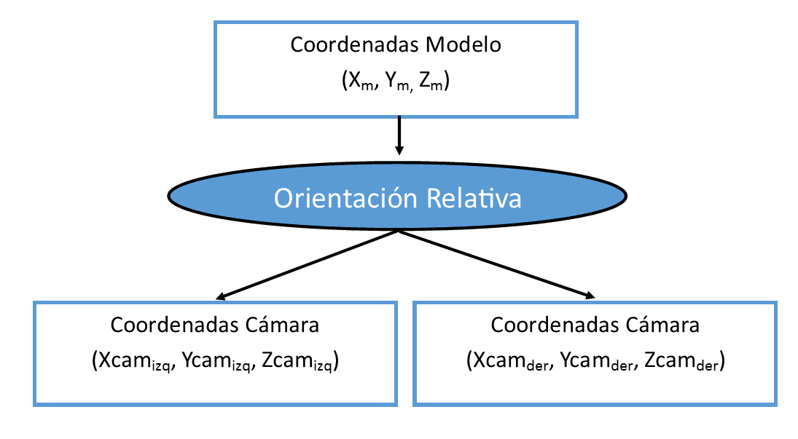

# Orientación Relativa

Ayuda online de productos Digi21

Es una orientación presente únicamente en el caso de que el modelo cargado en el [sensor cónico](sensor-conico-estereoscopico.md) sea un modelo estereoscópico y que relaciona dos imágenes \(izquierda y derecha\) mediante la condición de colinearidad.

Esta orientación transforma de _Coordenadas Modelo_ a _Coordenadas Cámara_ para las cámaras Izquierda y Derecha simultaneamente. También permite obtener unas coordenadas modelo a partir de un par de _Coordenadas Cámara_.

Vea también

