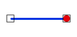

# PUNTO LINEA EXTREMO

Solicita que se seleccione un punto y una línea, e indica si el punto coincide con alguno de los extremos de la línea. 

## Parámetros

No admite parámetros.

## Observaciones

Se considera que el punto y la línea coinciden si la línea coinciden por el extremo si las coordenadas del primer o del último vértice de la línea coinciden \(en 2D\) con las del punto.

## Características de la orden

| Tipo de orden | [Orden interactiva](punto-linea-extremo.md) |
| :--- | :--- |
| Repite automáticamente | Si |
| Opción del menú donde aparece la orden | Análisis geométricos/Relaciones Punto - Línea/El punto coincide con un extremo de la línea |
| Barra de herramientas en la que aparece la orden | _Esta orden no tiene asociado ningún botón en ninguna barra de herramientas_ |
| Extensión | DigiNG.OrdenesTopologia.dll |
| Nombre interno de la orden | {FBC218C5-347C-4F40-98DE-4F9125CD7590} |
| Variables relacionadas | _Esta orden no se ve afectada por ninguna variable_ |

