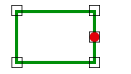

# PUNTO\_AREA\_COINCIDEN

Solicita que se seleccione un punto y un área \(línea cerrada o polígono\) indica si estos son o no coinciden. 

## Parámetros

No admite parámetros.

## Observaciones

Se considera que el punto y la área coinciden si el borde del área o el borde de cualquiera de sus huecos tiene un vértice cuyas coordenadas \(en 2D\) coincidan con el punto.

## Características de la orden

| Tipo de orden | [Orden interactiva](punto_area_coinciden.md) |
| :--- | :--- |
| Repite automáticamente | Si |
| Opción del menú donde aparece la orden | Análisis geométricos/Relaciones Punto - Area/Coinciden |
| Barra de herramientas en la que aparece la orden | _Esta orden no tiene asociado ningún botón en ninguna barra de herramientas_ |
| Extensión | DigiNG.OrdenesTopologia.dll |
| Nombre interno de la orden | {E4FCD8DF-8C94-44D2-844B-65A8FB890705} |
| Variables relacionadas | _Esta orden no se ve afectada por ninguna variable_ |

