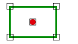

# PUNTO\_AREA\_INTERIOR

Solicita que se seleccione un punto y un área \(línea cerrada o polígono\) indica si el punto está en el interior del área. 

## Parámetros

No admite parámetros.

## Observaciones

Se considera que el punto está en el interior del área si está dentro de ésta y fuera de todos lo huecos que tenga el área.

## Características de la orden

| Tipo de orden | [Orden interactiva](punto_area_interior.md) |
| :--- | :--- |
| Repite automáticamente | Si |
| Opción del menú donde aparece la orden | Análisis geométricos/Relaciones Punto - Area/El punto está en el interior del área |
| Barra de herramientas en la que aparece la orden | _Esta orden no tiene asociado ningún botón en ninguna barra de herramientas_ |
| Extensión | DigiNG.OrdenesTopologia.dll |
| Nombre interno de la orden | {9D9886BB-308F-4968-A2AA-D8DFB9D8F61D} |
| Variables relacionadas | _Esta orden no se ve afectada por ninguna variable_ |

