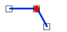

# PUNTO\_LINEA\_COINCIDEN

Solicita que se seleccione un punto y una línea, e indica si estos coinciden. 

## Parámetros

No admite parámetros.

## Observaciones

Se considera que el punto y la línea coinciden si la línea tiene algún vértice \(**siempre que no sea el primer o último vértice de la línea\)** cuyas coordenadas coinciden \(en 2D\) con las del punto.

## Características de la orden

| Tipo de orden | [Orden interactiva](punto_linea_coinciden.md) |
| :--- | :--- |
| Repite automáticamente | Si |
| Opción del menú donde aparece la orden | Análisis geométricos/Relaciones Punto - Línea/Coinciden |
| Barra de herramientas en la que aparece la orden | _Esta orden no tiene asociado ningún botón en ninguna barra de herramientas_ |
| Extensión | DigiNG.OrdenesTopologia.dll |
| Nombre interno de la orden | {BB0A1B9A-0100-42AA-8248-8FB838B2594E} |
| Variables relacionadas | _Esta orden no se ve afectada por ninguna variable_ |

