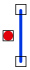

# PUNTO\_LINEA\_DISJUNTOS

Solicita que se seleccione un punto y una línea, e indica si estos son o no disjuntos. 

## Parámetros

No admite parámetros.

## Observaciones

Se considera que el punto y la línea son disjuntos si la línea no tiene ningún vértice cuyas coordenadas \(en 2D\) coincidan con el punto.

## Características de la orden

| Tipo de orden | [Orden interactiva](punto_linea_disjuntos.md) |
| :--- | :--- |
| Repite automáticamente | Si |
| Opción del menú donde aparece la orden | Análisis geométricos/Relaciones Punto - Línea/Disjuntos |
| Barra de herramientas en la que aparece la orden | _Esta orden no tiene asociado ningún botón en ninguna barra de herramientas_ |
| Extensión | DigiNG.OrdenesTopologia.dll |
| Nombre interno de la orden | {D3D67811-E51D-448F-B888-06FD4CEDC229} |
| Variables relacionadas | _Esta orden no se ve afectada por ninguna variable_ |

