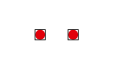

# PUNTO\_PUNTO\_DISJUNTOS

Solicita que se seleccionen dos puntos, e indica si estos son o no disjuntos. 

## Parámetros

No admite parámetros.

## Observaciones

Se considera que dos puntos son disjuntos si sus coordenadas \(en 2D\) son distintas.

## Características de la orden

| Tipo de orden | [Orden interactiva](punto_punto_disjuntos.md) |
| :--- | :--- |
| Repite automáticamente | Si |
| Opción del menú donde aparece la orden | Análisis geométricos/Relaciones Punto - Punto/Disjuntos |
| Barra de herramientas en la que aparece la orden | _Esta orden no tiene asociado ningún botón en ninguna barra de herramientas_ |
| Extensión | DigiNG.OrdenesTopologia.dll |
| Nombre interno de la orden | {164288ED-5666-4A35-9408-68B422C31341} |
| Variables relacionadas | _Esta orden no se ve afectada por ninguna variable_ |

Vea también

